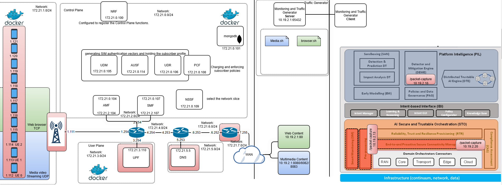

# Open5GS-UERANSIM-CRAAX 

## Execution Instructions:

To start the environment and run the main scripts, use these commands:

```bash
sudo docker volume create mytb-data
sudo docker volume create mytb-logs
docker-compose up --build -d
python3 ./scripts/create_users.py  
python3 ./scripts/execute_gnb_ue.py 
python3 ./TCPserver/server.py & > /dev/null
```

## Monitoring and Traffic Generation Scripts

The system includes specific commands for running monitoring and traffic generation scripts. Here are the usage instructions:

**Extecute the script:**
```bash
python3 cliente.py
```

Help:  
- `trafgen media <time>` - Execute the traffigen media script in ue-0, ue-1, ue-2 X time

## Architecture



### Based on:
[Infinitydon's Open5GS Docker Compose for IoT](https://bitbucket.org/infinitydon/open5gs-5gcore-ueransim-iot-docker-compose/src/master/)
